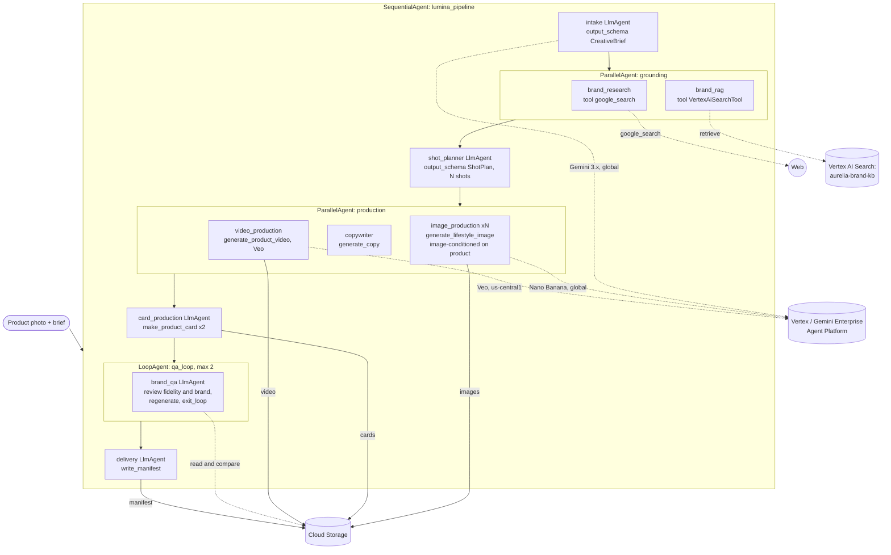

# Architecture — Lumina Studio Agent

Input: a **product photo** (gs:// URI in session state `product_image_uri`) + a text brief
(+ optional brand link). Output: an on-brand content package — N lifestyle images faithful to
the real product, 2 marketplace product cards, ad copy, and a short product video.

## Multi-agent graph (implemented)



## State flow (ADK session state)
| Stage | Agent(s) | Reads | Writes (`output_key`) |
|---|---|---|---|
| 0 | runner / order | — | `product_image_uri` (seeded) |
| 1 | `intake` | user brief | `brief` (CreativeBrief) |
| 2 | `brand_research` + `brand_rag` | `brief` | `brand_research`, `brand_knowledge` |
| 3 | `shot_planner` | `brief`, `brand_research`, `brand_knowledge` | `plan` (ShotPlan, N shots) |
| 4 | `image_production` + `copywriter` + `video_production` | `plan`, `brief`, `product_image_uri` | `images`, `copy_doc`, `videos` |
| 5 | `card_production` | `brief`, `plan`, `copy_doc`, `product_image_uri` | `cards` |
| 6 | `brand_qa` (loop, max 2) | `brief`, `images`, `product_image_uri` | `qa_report` |
| 7 | `delivery` | `images`, `cards`, `videos`, `copy_doc`, `qa_report` | `package` |

Tools read `product_image_uri` from `ToolContext.state` (not via the LLM) for reliable fidelity.

## Key capabilities
- **Product fidelity:** image + video are conditioned on the real product photo (reference Part /
  Veo first frame); `review_image_brand_fit` compares original vs generated and fails on drift.
- **Grounding:** `google_search` (live web) + `VertexAiSearchTool` over the `aurelia-brand-kb`
  data store (palette hex, tone, imagery rules, forbidden elements) feed the planner.
- **Scale:** `settings.image_count` shots (env `IMAGE_COUNT`; DEV=5 / FULL 12-20), fan-out.
- **Product cards:** background generated (product-conditioned) + crisp text composited with Pillow.
- **Video:** Veo image-to-video, async, written straight to GCS (`output_gcs_uri`).
- **Self-correcting QA:** a `LoopAgent` regenerates failing shots, `exit_loop` escalates to stop.
- **Robustness:** image gen is throttled (`Semaphore`, env `IMAGE_CONCURRENCY`) + backoff on 429.

## Platform / models (verified 2026-06-01)
- SDK `google-genai` on Vertex backend (legacy `vertexai.*` removed 2026-06-24).
- Gemini 3.x (text + image) use the `global` endpoint; Veo runs in `us-central1`.
- `gemini-3.5-flash` (reasoning/QA), `gemini-3.1-flash-image` (Nano Banana 2),
  `veo-3.1-fast-generate-001` (video). Full config: `gcp.env`.
- Deployed: Agent Engine `…/reasoningEngines/4329993888170246144` (us-central1, Cloud Trace).

## Marketplace + A2A (implemented)
- `marketplace/` — FastAPI order UI + **escrow state machine** on Firestore
  (Funded → InProgress → Delivered → Released / Refunded). The agent runs in a worker thread
  (blocking image/Veo tools must not block the web loop); assets are served via a GCS proxy.
  Deployed to Cloud Run.
- The agent is also published as an **A2A** service (`to_a2a`), mounted on the marketplace at
  `/a2a`, with a discoverable AgentCard at `/a2a/.well-known/agent-card.json` (protocol 0.3.0) —
  other agents can hire it over the protocol.

## Planned
- Signed-URL delivery; real payment rails; richer multi-turn chat intake.
```
