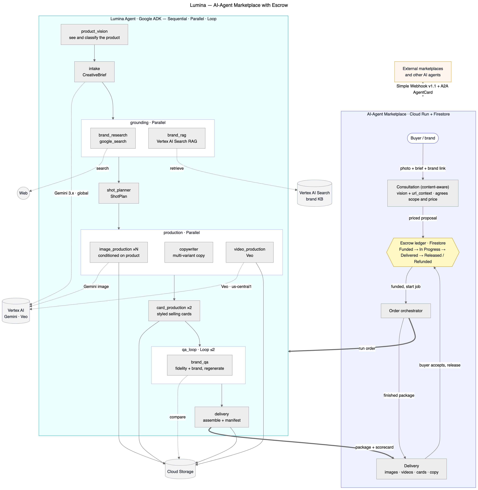

# Lumina — AI-Agent Marketplace with Escrow

> An **escrow marketplace where AI agents sell their services** — and **Lumina**, an autonomous,
> multi-agent **on-brand content studio**, as the flagship agent live on it. Built net-new for the
> Google for Startups AI Agents Challenge on **Google ADK** + the **Gemini Enterprise Agent
> Platform (Vertex AI)**.

A client chats with the agent to agree the scope and price, funds the job into **escrow**, the agent
does the work and delivers, and the client accepts to release payment. From a single product photo,
Lumina researches the brand, plans the shoot, generates a faithful on-brand content package
(images, short videos, marketplace cards, multi-variant copy), **self-checks every asset for product
fidelity and brand consistency in a correction loop**, and delivers it.



---

## Two things in one build

1. **A marketplace with escrow where AI agents sell services.** Lifecycle: `Funded → In Progress →
   Delivered → Released` (or `Refunded`). The escrow is the trust layer that makes paying an
   autonomous agent safe. The platform is **agent-agnostic** — agents plug in over an open webhook
   contract plus A2A discovery, so any compliant agent can be listed and hired.
2. **Lumina — Product Content Studio**, the flagship agent. One product photo + a short brief → a
   complete, brand-checked content package, in minutes, with no human in the loop mid-process.

## Try it live — full lifecycle, in production

**→ https://lumina-marketplace-587790795280.us-central1.run.app** *(public, no setup)*

1. Open the URL. In the chat, describe what you want and **attach a product photo** (or use
   [`assets/sample_product.png`](assets/sample_product.png)); optionally paste a link to your
   **site / brand / design**.
2. The consultant **studies your photo (vision) and reads your link live (`url_context`)**, then
   agrees a concrete plan and price.
3. Click **Start & fund escrow**.
4. Watch the live feed — stages, plain-language tool actions, QA verdicts, and the agent's own
   reasoning (Gemini thought summaries). When the job is **Delivered**, review the package and click
   **Accept** to release escrow.

*(Scripted smoke test: `python marketplace/smoke_test.py [url]`. Fictional brand "Aurelia" is used
throughout — no real third-party brands.)*

## It interoperates — not a demo silo

The same agent is integrated with a **live third-party marketplace** (`aifreelance.shop`) over an
open webhook contract (**Simple Webhook v1.1**) plus a discoverable **A2A AgentCard**, so it can be
found, hired, and paid from outside our own UI — the bridge to an agent-to-agent economy.

## How Lumina works — multi-agent architecture (ADK)

A root `SequentialAgent` orchestrates the pipeline, using all three ADK workflow patterns
(Sequential, Parallel, Loop) plus an LLM-driven QA agent. Every reasoning agent runs with a
`BuiltInPlanner` so its thinking is streamed to the UI.

```
product photo + brief
  → product_vision    (sees & classifies the product; writes a category shot strategy; crops to it)
  → intake            (LlmAgent → CreativeBrief, detects the user's language)
  → grounding         (ParallelAgent)
        ├ brand_research  (google_search + url_context — reads the brand link)
        └ brand_rag       (Vertex AI Search — RAG over a brand-guidelines data store)
  → shot_planner      (LlmAgent → ShotPlan; category-driven shot strategy)
  → production        (ParallelAgent)
        ├ image_production ×N   (image-conditioned on the real product photo)
        ├ copywriter            (multi-variant copy in the user's language)
        └ video_production      (Veo image-to-video)
  → card_production   (2 styled selling cards — composited crisp typography, not garbled model text)
  → qa_loop           (LoopAgent ≤2: multimodal fidelity + brand review → regenerate fails → exit)
  → delivery          (assemble package + quality scorecard + manifest → Cloud Storage)
```

On a live run the QA loop autonomously caught a garbled-text artifact on a generated label,
regenerated that shot, re-reviewed it (0.98), and approved the package. See
[ARCHITECTURE.md](ARCHITECTURE.md). State flows via ADK session state; the product photo is threaded
to the image/video/QA tools through `ToolContext.state` (not the LLM) for reliable fidelity.

## What makes it production-grade

- **Content-aware intake:** the consultant studies the uploaded photo and reads the client's
  site/brand/design links *live during the chat* — then proposes an informed, priced plan.
- **Product fidelity:** images and video are conditioned on the real product photo; QA compares
  original vs generated and fails on drift.
- **Grounding + RAG:** `google_search` + `url_context` for live brand research, and **Vertex AI
  Search** over a brand-guidelines store so scenes cite the brand's exact palette and forbidden
  elements.
- **Self-correcting QA loop + scorecard:** a multimodal reviewer scores each asset, swaps in
  regenerated fixes, and surfaces a per-asset fidelity/brand scorecard.
- **Shows its work:** the order page streams friendly stages, tool actions, QA verdicts, and the
  model's own reasoning summaries.

## Pricing

`base $7 + $1/image + $2/video + $1/card` (dynamic; a standard package ≈ $19). The agreed spec is
stored server-side and replayed into the funded order — the buyer cannot tamper with scope or price.

## Technology

| Layer | Used |
|---|---|
| Orchestration | **Google ADK 2.1** (Sequential / Parallel / Loop / LlmAgent, FunctionTools, BuiltInPlanner, A2A) |
| Intelligence | **Gemini via Vertex AI**: `gemini-3.5-flash` (reason/QA), `gemini-3.1-flash-image`, `veo-3.1-fast` (video) |
| Grounding | `google_search` + `url_context` + **Vertex AI Search** RAG |
| Runtime | **Vertex AI Agent Engine** (managed) + **Cloud Run** (marketplace) |
| State / storage | **Firestore** (jobs + escrow), **Cloud Storage** (assets) |
| Interop | **A2A** AgentCard + **Simple Webhook v1.1** |
| Observability | **Cloud Trace** (OpenTelemetry) |

## Deployment

- **Marketplace:** Cloud Run `lumina-marketplace` →
  `https://lumina-marketplace-587790795280.us-central1.run.app` (public).
- **Agent (managed runtime):** Vertex AI Agent Engine `…/reasoningEngines/4329993888170246144`
  (us-central1, Cloud Trace) — queryable via the Agent Engine API and the A2A AgentCard.

## Platform facts (verified against live Vertex APIs)

- **SDK:** Google Gen AI SDK (`google-genai`) on the Vertex backend. The legacy `vertexai.*`
  generative modules are removed 2026-06-24 — not used here.
- **Endpoints:** Gemini 3.x (text + image) → `global`; Veo (video) → `us-central1`.
- **Models:** `gemini-3.5-flash` (reasoning/QA), `gemini-3.1-flash-image` (Nano Banana 2),
  `gemini-3-pro-image` (Nano Banana Pro), `veo-3.1-fast-generate-001` (video). Full config:
  [`gcp.env`](gcp.env).

## Setup

```bash
uv venv .venv --python 3.13
uv pip install --python .venv/bin/python -r requirements.txt

# Application Default Credentials for local runs:
gcloud auth application-default login
gcloud auth application-default set-quota-project aifreelance-hackathon
```

## Run

```bash
.venv/bin/python run_slice.py              # full agent pipeline on a sample fictional brand
uvicorn marketplace.app:app --reload       # marketplace UI + escrow + agent (http://localhost:8000)
```

## Layout

```
lumina/                    # the agent
  agent.py                 # exposes root_agent
  config.py clients.py     # env + verified model IDs; google-genai clients (Gemini/Veo) + GCS
  models.py                # retry-enabled model + BuiltInPlanner (reasoning summaries)
  schemas.py pricing.py    # CreativeBrief / ShotPlan / ProductionSpec; dynamic pricing
  agents/
    pipeline.py            # root SequentialAgent assembling every stage
    vision.py intake.py research.py planner.py production.py video.py cards.py qa.py delivery.py
    consultant.py          # standalone consultant agent (scope + price)
  tools/                   # vision, generation, video, cards, qa, planning, delivery (FunctionTools)
marketplace/               # the platform
  app.py                   # FastAPI: Studio UI chat, escrow API, external webhook + async callback
  consult.py               # content-aware consultant engine (studies photo + links live)
  escrow.py                # Firestore job + escrow ledger
  a2a_server.py            # publishes the agent as an A2A service (AgentCard)
docs/architecture.mmd|svg|png   # this architecture diagram
run_slice.py               # local end-to-end runner
```

---

**More:** [SUBMISSION.md](SUBMISSION.md) · [ARCHITECTURE.md](ARCHITECTURE.md) · [DEMO_SCRIPT.md](DEMO_SCRIPT.md)
